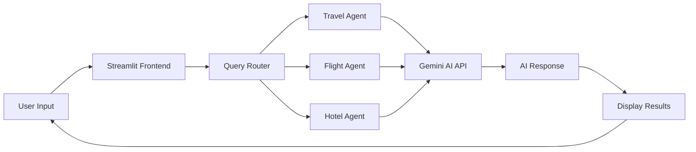

# 🌍 Travel Assistant


**Travel Assistant** is an AI-powered web application that helps users plan trips, get travel suggestions, and find information about destinations using **Google Gemini AI**. It features a **Streamlit frontend**, modular agent architecture, and Docker support for seamless deployment.

---

## 📋 Description

This project acts as an intelligent **AI Travel Planner** that responds to user queries about:
- ✈️ Travel destinations and itineraries
- 🏨 Hotel recommendations and bookings
- 🛫 Flight information and scheduling
- 🗺️ Local attractions and travel tips

Built with **Streamlit** for an intuitive interface and **Google Gemini AI** for natural language processing, this assistant provides personalized travel advice based on user preferences and requirements.

---

## 🛠️ Technologies

| Technology | Purpose |
|------------|---------|
| **Python 3.10+** | Core programming language |
| **Streamlit** | Interactive web UI framework |
| **Google Gemini AI** | AI model for intelligent responses |
| **Docker** | Containerization and deployment |
| **Virtual Environment (venv)** | Dependency isolation |
| **Git** | Version control |

---

## 📁 Project Structure

```
travel_assistant/
│
├── agents/
│   ├── __init__.py
│   ├── travel_agent.py      # Main agent handling travel queries
│   ├── flight_agent.py      # Handles flight-related requests
│   └── hotel_agent.py       # Handles hotel-related requests
│
├── config/
│   ├── __init__.py
│   └── settings.py          # API keys and configuration constants
│
├── utils/
│   ├── __init__.py
│   └── helpers.py           # Utility functions (Gemini API integration)
│
├── streamlit_app.py         # Streamlit frontend interface
├── main.py                  # Entry point for running the app
├── requirements.txt         # Project dependencies
├── Dockerfile               # Docker setup configuration
├── .dockerignore            # Docker ignore rules
├── .gitignore               # Git ignore rules
├── .env.example             # Example environment variables
└── README.md                # Project documentation
```

---

## 🔄 Workflow



### Detailed Workflow:

1. **User Interaction:** User enters a travel-related query in the Streamlit app
2. **Query Processing:** The system routes the query to the appropriate agent (travel, flight, or hotel)
3. **Agent Handling:** Selected agent processes the query and formats it for the AI
4. **Gemini Processing:** The `helpers.py` module communicates with Google Gemini API
5. **Response Generation:** Gemini AI generates contextual, personalized travel recommendations
6. **Result Display:** The Streamlit app displays the AI-generated suggestions with rich formatting

---

## 🚀 Getting Started

### Prerequisites

- Python 3.10 or higher
- Git installed on your system
- Google Gemini API key ([Get one here](https://makersuite.google.com/app/apikey))
- (Optional) Docker for containerized deployment

### 🔹 Step 1: Clone the Repository

```bash
git clone https://github.com/<your-username>/travel-assistant.git
cd travel-assistant
```

### 🔹 Step 2: Set Up Virtual Environment

**Windows:**
```bash
python -m venv venv
venv\Scripts\activate
```

**Mac/Linux:**
```bash
python3 -m venv venv
source venv/bin/activate
```

### 🔹 Step 3: Install Dependencies

```bash
pip install -r requirements.txt
```

### 🔹 Step 4: Configure API Keys

1. Copy the example environment file:
```bash
cp .env.example .env
```

2. Open `.env` and add your Gemini API key:
```env
GEMINI_API_KEY=your_api_key_here
```

Alternatively, update `config/settings.py`:
```python
GEMINI_API_KEY = "your_api_key_here"
```

### 🔹 Step 5: Run the Application

```bash
streamlit run streamlit_app.py
```

Your app will open automatically in your browser at:
```
👉 http://localhost:8501
```

---

## 🐳 Docker Deployment

### Build the Docker Image

```bash
docker build -t travel-assistant .
```

### Run the Docker Container

```bash
docker run -p 8501:8501 --env-file .env travel-assistant
```

Then visit `http://localhost:8501` in your browser.

### Docker Compose (Optional)

```bash
docker-compose up
```

---

## 📊 Data & Features

### Current Features:
- 💬 Natural language query processing
- 🎯 Context-aware travel recommendations
- 🔄 Multi-agent architecture (Travel, Flight, Hotel)
- 🎨 Clean and responsive UI
- 📱 Mobile-friendly interface

---

## 🔗 Links

| Resource | Link |
|----------|------|
| 📦 **GitHub Repository** | [github.com/your-username/travel-assistant](https://github.com/your-username/travel-assistant) |
| 🚀 **Live Demo** | [travel-assistant.streamlit.app](https://travel-assistant.streamlit.app) |


---

## 👨‍💻 Author

**Kiran**  
AI & ML Developer | Student | Passionate about Intelligent Systems

- 🌐 Portfolio: [your-portfolio.com](https://your-portfolio.com)
- 💼 LinkedIn: [linkedin.com/in/your-profile](https://linkedin.com/in/your-profile)
- 📧 Email: your.email@example.com
- 🐙 GitHub: [@your-username](https://github.com/your-username)

---

## 🙏 Acknowledgments

- Google Gemini AI for providing the AI capabilities
- Streamlit for the amazing web framework
- The open-source community for inspiration and support

<div align="center">

**⭐ Star this repo if you find it helpful!**

Made with ❤️ by Kiran

</div>